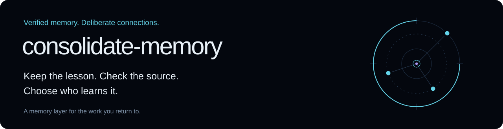
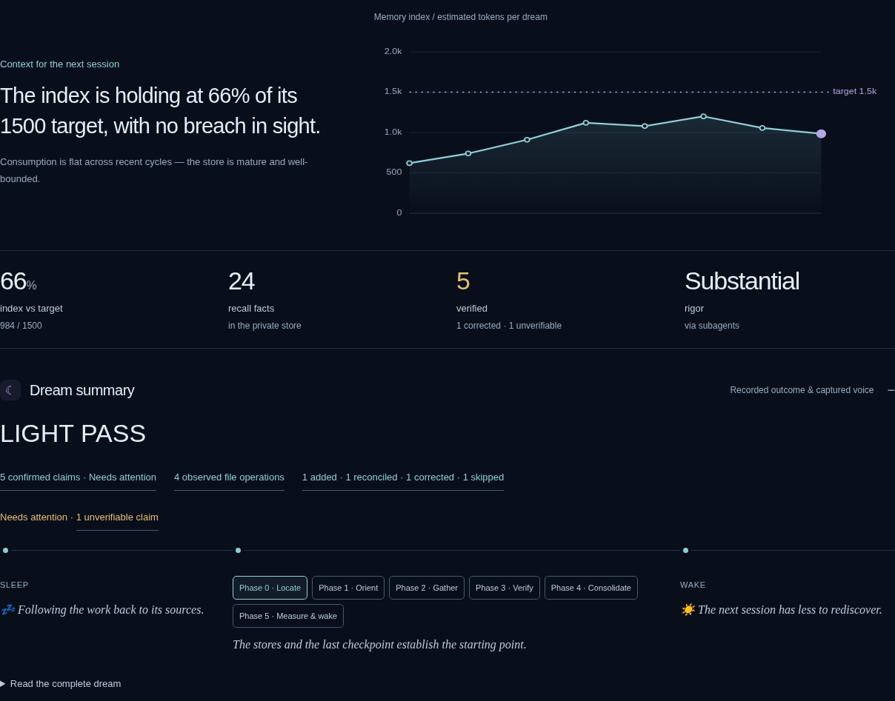
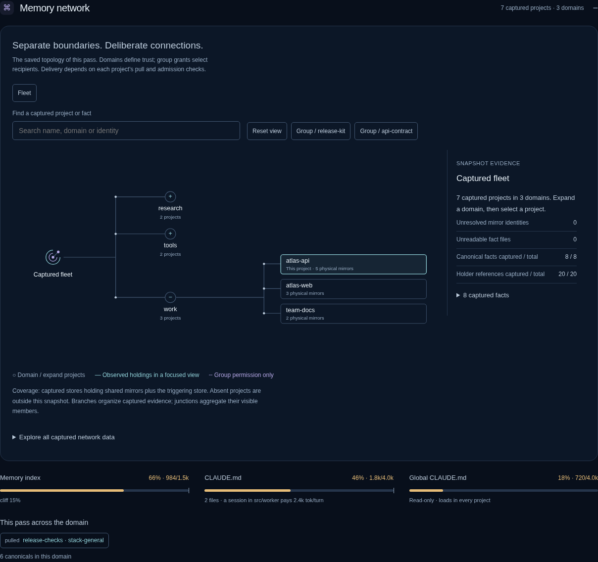
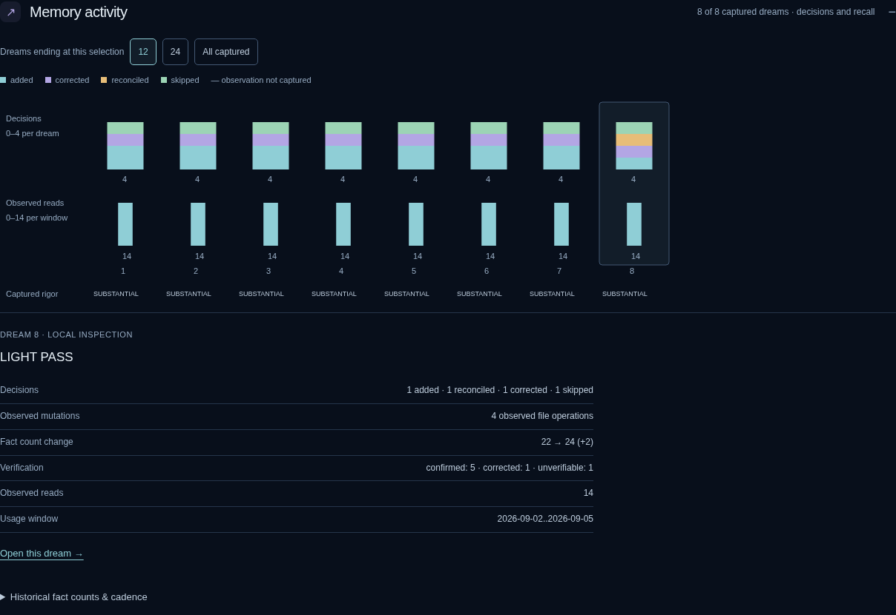
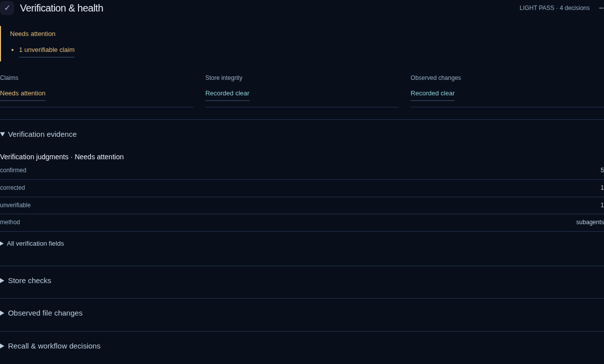
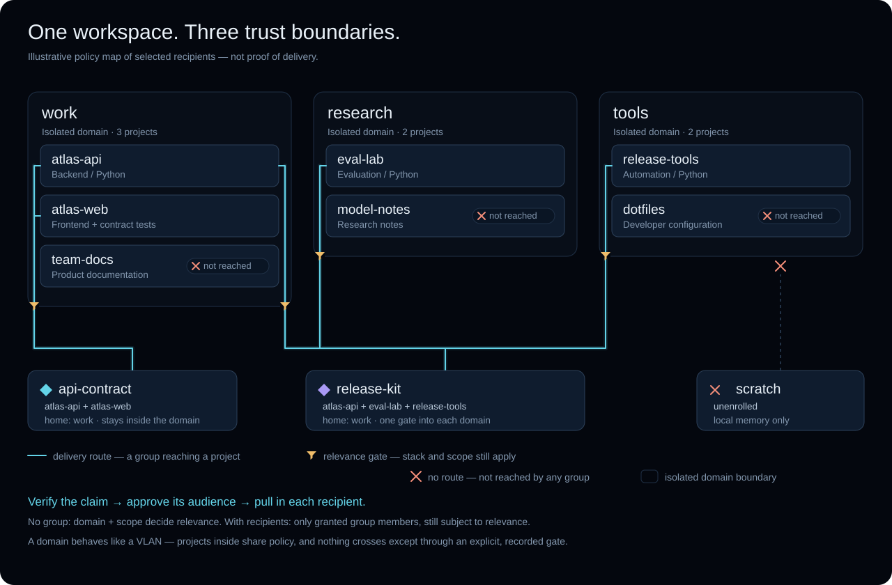
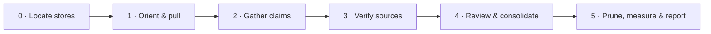

<p align="center">
  
</p>

<p align="center">
  <a href="https://github.com/Zenetusken/consolidate-memory/actions/workflows/ci.yml"></a>
  <a href="CHANGELOG.md"></a>
  <a href="LICENSE"></a>
</p>

# consolidate-memory

**Give your next Claude Code session the lessons your last one earned.**

A Claude Code plugin that turns project history and session feedback into **verified,
reusable memory**. Check a lesson against the current code, keep a useful recall cue,
and share it with the projects you choose. When the code changes, revisit the memory.

Useful when you maintain several repositories, return to work after a break, or keep
explaining the same testing conventions, architectural decisions, and hard-won gotchas.
One explicit **`dream`** produces a reviewed memory update and an inspectable report.

<p align="center">
  <a href="#why">Why use it</a> · <a href="#start">Quick start</a> ·
  <a href="#network">Build a memory network</a> · <a href="#dashboard">See the dashboard</a> ·
  <a href="#commands">Commands</a> · <a href="#development">Contribute</a>
</p>

> [!NOTE]
> **Current release: v0.4.16.** Public 1.0 remains **HOLD**, with outstanding evidence
> gates tracked in the [1.0 preflight](docs/1.0-preflight.spec.md).
> See the [changelog](CHANGELOG.md) for shipped changes.

<a id="why"></a>
## 🧠 Less rediscovery. Better context.

| When this happens… | What a dream helps you retain |
| :--- | :--- |
| You fix a subtle bug, then meet it again months later | The verified cause and a recall cue that points to the explanation |
| The README, agent instructions, and memory disagree | A correction grounded in the live files and commit history |
| Several repos use the same tools | Relevant shared lessons, absorbed into each enrolled project's own memory |
| Client work and personal experiments must stay separate | Explicit trust domains, with narrowly granted exceptions through groups |
| The memory index keeps growing | Measured context cost, stale-fact review, and proposals to move detail out of the always-loaded tier |
| You repeat the same multi-step checks across projects | Evidence for a reusable command or skill, proposed for your decision |

**For example:** you learn why a queue worker needs jittered retries. A dream checks
that claim against the implementation and keeps the rationale where a future session
can find it. A broader Python tooling lesson can be verified in another repo and
shared with eligible projects. A claim with no supporting evidence is flagged or dropped.

Claude Code's [native memory](https://code.claude.com/docs/en/memory) supplies project
instructions and recall. This plugin adds an explicit verification workflow, governed
cross-project sharing, and a record of what changed. The scripts use Python's standard
library; the agent performs the reasoning and source checks.

<a id="start"></a>
## 🚀 From install to your first dream

**Requires:** Claude Code with plugins and auto-memory enabled, `python3` **3.8+** on
PATH **with the `sqlite3` stdlib module (SQLite ≥ 3.24)** — no system sqlite3 binary
needed — and a POSIX environment (Linux, macOS, or WSL). No runtime packages to
install. Native Auto-Memory features are **not** required — the plugin is
self-contained; `git` is optional (dream scope degrades without it). Check all of
this up front with `python3 "${CLAUDE_PLUGIN_ROOT}/scripts/preflight.py ."` after
installing (exit 0 = clean; exit 2 = fix the FAILs first).

In Claude Code:

```text
/plugin marketplace add Zenetusken/consolidate-memory
/plugin install consolidate-memory@zenetusken-plugins
```

Use the Git `owner/repo` form above: relative plugin paths do not resolve from a
direct URL to `marketplace.json`.

Then, after a useful work session:

```text
dream
```

Or say **“consolidate my memory.”** The pass gathers candidate lessons, checks the
current code, shows the proposed changes, and records the decisions. Its final
output links to your local HTML report.

**Start with one project.** Local consolidation works without enrollment. To share
between two repos, run `/cm-connect ../other-repo`; it surveys both, presents the
enrollment plans for your confirmation, offers a first shared fact, and syncs both.
It uses the `personal` domain for unenrolled projects; use `/cm-domain` for a different
boundary. An existing domain is never silently switched.

> [!TIP]
> Ask `/cm-doctor` to show the resolved stores, enrollment, and registry health.
> **`UNENROLLED LOCAL-ONLY`** means local memory works and cross-project sharing is off.

<a id="dashboard"></a>
## 🌌 See what the system actually kept

**Nocturne** is the memory observatory that closes a dream: a self-contained HTML
archive, rendered from the same structured cycle record as the terminal summary.
Start with the recorded outcome, then follow a claim, project, or decision to its
evidence. Open the generated file in a browser; it needs no server or internet connection.



| What do you want to know? | Where to look |
| :--- | :--- |
| **What did this dream accomplish?** | **Dream summary** leads with the recorded outcome, verified claims, observed changes, and attention items. Select a passage in the Sleep → beats → Wake sequence, or read the complete dream. |
| **Who holds this lesson, and who may receive it?** | **Memory network** unfolds from fleet → domains → projects. Select a project for its facts and costs, a fact for its recorded holders, or a group for its permitted members. |
| **What changed over time?** | **Memory activity** aligns exact decision categories, observed reads, and captured rigor. Choose **12 / 24 / All captured** dreams, inspect a cycle locally, then use **Open this dream** to navigate. |
| **What needs attention, and what supports the result?** | **Verification & health** puts exceptions first, with expandable verification evidence, store checks, observed file changes, and recall/workflow decisions. Before/after diffs remain one click away. |

The header keeps the **memory-index trajectory and budget projection**. Historical
fact counts and cadence remain available in the activity table. Decisions, physical
file changes, and observed usage have separate labels; missing observations stay
explicitly **Not captured**. Token figures are estimates, approximately characters ÷ 4.

<details>
<summary><strong>Explore the network, activity, and evidence</strong></summary>

### Expand a domain. Follow a fact.

Every captured domain appears, with the current project's domain expanded first.
Browse projects in pages of 12, or search by name, domain, or identity. A selected
fact branches to its physical holders; a selected group branches to its permitted
members. The inspector explains the evidence, and breadcrumbs return to the fleet.



New snapshots identify shared facts by their canonical identity, so differently
named local mirrors of one lesson count as one fact. Older archives retain their
recorded links and explicitly identify missing canonical detail. The view covers
captured shared-memory stores plus the triggering project; absent projects are
outside that snapshot.

### Inspect activity before opening another dream

Select a cycle to see its outcome, decisions, observed mutations, fact-count change,
verification, and usage window. Reads from overlapping windows are never added into
a misleading total, and missing observations remain gaps.



### Follow an attention item to its evidence

Claims, store integrity, and observed changes each show **Needs attention**,
**Recorded clear**, **Partially captured**, or **Not captured**. Adverse or pending
details open by default. Expand the evidence to inspect preflight timestamps and
failure IDs, file diffs, recall observations, workflow verdicts, and decline lineage.



</details>

Choose **Nocturne**, **Original** (the espresso dark palette), **Light**, or **System**.
The archive retains filtering, sorting, previous/next navigation, compact mode,
keyboard controls, reduced motion, print support, and complete captured records.
On narrow screens, the network becomes a vertical hierarchy with its inspector below.

**Try the fictional preview:** [HTML archive](docs/previews/nocturne/index.html#sel=7) ·
[dashboard network SVG](docs/assets/nocturne-network.svg) ·
[design and validation notes](docs/nocturne-design.md).
Download the HTML and open it locally at `#sel=7`; GitHub shows its source rather
than running it. All screenshots and preview data use **fictional projects**.

<a id="network"></a>
## 🕸️ Build a network with boundaries

Imagine maintaining a product, a research lab, and shared developer tools on one
machine. You want lessons to travel where they apply, while each area keeps its own
memory boundary.



### The VLAN analogy, made concrete

| Network idea | Memory-system equivalent | What it actually means |
| :--- | :--- | :--- |
| VLAN / isolated segment | **Domain** | A project joins one domain by operator grant. Ordinary shared facts stay inside it. |
| Selected endpoints with a routing rule | **Group** | A named recipient set can narrow delivery within a domain or bridge specific projects across domains. |
| Traffic selected by purpose | **Scope and stack relevance** | `user-global` applies throughout the authorized audience; `stack-general` also requires a matching detected stack. |
| Endpoint fetching an update | **Pull** | A receiving project absorbs admitted facts on its next dream or `/cm-sync`. |
| Disconnected endpoint | **Unenrolled project** | Local memory only; it cannot create or pull shared canonicals. |

This is a **local memory-delivery policy**, not an IP network or an OS security
sandbox. Domains and groups do not create network sockets or synchronize machines.

### One common topology, four delivery cases

The example has `work` (`atlas-api`, `atlas-web`, `team-docs`), `research`
(`eval-lab`, `model-notes`), and `tools` (`release-tools`, `dotfiles`).
`scratch` stays unenrolled.

| Example fact | Intended audience | Who stays outside |
| :--- | :--- | :--- |
| A verified account/tooling convention, `user-global` in `work` | All three `work` projects | `research`, `tools`, and `scratch` |
| A Python lesson, `stack-general`, no group | Matching Python projects **in the fact's home domain** | Nonmatching projects and other domains |
| A lesson addressed to `api-contract` | Only `atlas-api` and `atlas-web`, subject to scope/relevance checks | Even `team-docs`, despite sharing their domain |
| A lesson addressed to `release-kit` | `atlas-api`, `eval-lab`, and `release-tools`, subject to scope/relevance checks | Every other repo; their domains are not opened wholesale |

**Groups narrow the audience.** A fact naming `release-kit` reaches eligible members
of that group; it does not also broadcast to all of `work`. A group has a home domain,
and a canonical fact can target only groups created in that same home domain.
Multiple named groups form a recipient union; stack relevance still applies.

### Set it up in Claude Code

1. **Create the boundaries.** In each repo, use `/cm-domain` and specify `work`,
   `research`, or `tools`. Review each enrollment plan. Leave `scratch` unenrolled.
2. **Grant the bridges.** Use `/cm-group` to create `release-kit` in `work` and add
   `atlas-api`, `eval-lab`, and `release-tools`. Create `api-contract` in `work` and
   add `atlas-api` and `atlas-web`. The command presents each grant for confirmation.
3. **Share a verified lesson.** In `atlas-api`, run `/cm-share "<one claim sentence>"`.
   When asked about delivery, choose a group or the whole domain. Review the exact
   fact and recipient exclusions before confirming.
4. **Absorb and inspect.** In each recipient, run `/cm-sync`, or wait for its next
   dream. Run `/cm-network` to inspect recorded holdings, costs, and utility.

For exact CLI syntax, a complete enrollment/group walkthrough, revocation behavior,
and troubleshooting, see **[the network guide](docs/network-guide.md)**.

> [!IMPORTANT]
> **Permission is not delivery.** A recipient may not have pulled yet, may not match
> the stack, or may be held at its memory budget ceiling. The dashboard distinguishes
> physical holdings, registry holder counts, and group permissions. These measure
> different things; a partial count alone does not establish failed synchronization.

<a id="commands"></a>
## 🧭 A command for each intent

These are the packaged commands available to marketplace users:

| Intent | Command | Behavior |
| :--- | :--- | :--- |
| Consolidate this project's memory | `dream` | Full six-phase pass |
| Connect two projects | `/cm-connect <other-repo>` | Survey, confirmed enrollment, optional share, sync both |
| Show or change a trust boundary | `/cm-domain` | Show, enroll, move, or unenroll |
| Manage selected recipients | `/cm-group` | List, create, add, remove, or delete groups |
| Author one shared lesson | `/cm-share "<claim>"` | Verify, deduplicate, show, then write on confirmation |
| Absorb approved shared memory | `/cm-sync` | List, pull, and harvest usage; reports held facts |
| Inspect the fleet | `/cm-network` | Read-only topology, costs, and recall utility |
| Diagnose resolved paths and grants | `/cm-doctor` | Read-only setup and registry inspection |
| Manage retained plugin data | `/cm-data` | Inventory, export, compact, or scoped purge |

The SessionStart beacon can add one factual reminder when memory is behind. It is
read-only, never pulls, and stays silent on failure. Dreams run only when requested.

<a id="workflow"></a>
## 🔬 How a lesson becomes memory



Verification uses live files, symbols, git history, and documentation consistency.
Unverifiable claims are flagged or dropped. The proposal makes authoring and
irreversible changes reviewable; already-approved shared facts can be pulled earlier
in the pass. Every decision lands in the cycle record.

### Put detail where it costs the least

| Tier | What belongs there | When it loads |
| :--- | :--- | :--- |
| **Always loaded** | Concise project instructions and the `MEMORY.md` index | At session start |
| **Recall** | A useful description in the index pointing to a detailed fact | The cue loads first; the body is read when relevant |
| **On demand** | Full explanations, references, and repository documents | When the work calls for them |

The index target is **1,500 estimated tokens**; the pull ceiling is approximately
**3,840**. `CLAUDE.md` has a **4,000-token** target and is edited conservatively.
Scope decides **who** can use a fact; tier decides **how** it enters context.

### Repeated work can become a reusable workflow

The distill step looks for recurring command templates and command chains, including
how many days and projects supplied the evidence. It can propose a command or skill.
Existing coverage, weak evidence, or ordinary repeated commands can produce a
**“create nothing”** verdict; that decision is recorded too. Nothing is auto-authored.

<a id="privacy"></a>
## 🔒 Local storage, explicit sharing

The bundled scripts make no network calls or telemetry requests. Memory files and
the HTML report stay local. The agent uses Claude Code's configured model service
for reasoning; this is not a claim that the entire agent session runs offline.

- **Enrolled by choice:** repositories cannot grant themselves cross-project access.
- **Protected writes:** the canonical writer journals updates; locally edited mirrors
  enter conflict handling instead of being silently overwritten.
- **Secret filtering:** credential-shaped transcript text is omitted at retrieval;
  the firewall also guards shared-fact authoring and workflow emission.
- **Bounded context:** oversized indexes hold new pulls, with the held count surfaced.

See [SECURITY.md](SECURITY.md) for the enforced properties and limitations.

<details>
<summary><strong>Updating, migration, and removing your data</strong></summary>

Use Claude Code's `/plugin` manager to update or uninstall the plugin. Marketplace
refresh and installed-plugin updates are separate operations; see the
[official plugin reference](https://code.claude.com/docs/en/plugins-reference).

**Coming from the legacy global store (before v0.3.0)?** Domain enrollment changed
the trust boundary. Use an **enrolled maintenance project** to inventory, explicitly
assign or exclude, and migrate the legacy facts before enrolling the remaining
recipients. First enrollment revokes managed mirrors the destination does not admit,
so review the maintenance caller's enrollment plan too. Verify the migration before
finalizing; rollback is available only before finalization. The
[network guide](docs/network-guide.md#migration-and-revocation) includes the commands.

Uninstalling removes plugin code; it leaves memory data intact. Use `/cm-data` for
scoped cleanup. Do not delete the native memory directory wholesale: it also contains
Claude Code memory that this plugin does not own. Resolve actual paths with `/cm-doctor`.

Revocation through `forget` is acknowledged lazily on subsequent pulls or GC; an
offline copy retains bytes until it runs. Native Windows mutation is unsupported;
use WSL. Missing POSIX locking fails closed.

</details>

<a id="development"></a>
## 🛠️ Develop and contribute

Clone this repository and dogfood the packaged artifact:

```bash
claude plugin marketplace add ./
claude plugin install consolidate-memory@zenetusken-plugins
```

The checkout's `./cm` wrapper is a **maintainer CLI**. Marketplace users use the
commands above. Common development checks:

```bash
python3 tests/smoke.py
python3 tests/simulate_accumulation.py
mypy --config-file mypy.ini
./cm status
python3 tests/validate_manifests.py
claude plugin validate ./plugins/consolidate-memory --strict
```

Runtime scripts stay **stdlib-only**. Mypy and the separate Chromium CI checks are
development tools. For a reproducible visual preview:

```bash
python3 tests/dashboard_fixture.py --out /tmp/cm-preview
# Open /tmp/cm-preview/index.html#sel=7 in a browser.
# With the development-only Playwright + Chromium tools installed:
python3 tests/dashboard_browser.py --out /tmp/cm-browser
```

The optional **dream-beta-tester** companion tests the consolidation skill itself,
combining deterministic invariants with an agent judgment pass. Install with
`/plugin install dream-beta-tester@zenetusken-plugins` and invoke `/dream-beta-test`.
See its [design](plugins/dream-beta-tester/docs/SPEC.md) and
[report contract](plugins/dream-beta-tester/docs/CONTRACT.md).

| Find your way around | Source |
| :--- | :--- |
| Repository conventions and required gates | [AGENTS.md](AGENTS.md) |
| The six-phase workflow and tier rules | [SKILL.md](plugins/consolidate-memory/skills/consolidate-memory/SKILL.md) |
| Store topology, fact schema, verification recipes | [Harness map](plugins/consolidate-memory/skills/consolidate-memory/references/harness-map.md) |
| Native/canonical path resolution | [store_context.py](plugins/consolidate-memory/scripts/store_context.py) |
| Canonical writes and journal authority | [canonical_ingress.py](plugins/consolidate-memory/scripts/canonical_ingress.py), [control_plane.py](plugins/consolidate-memory/scripts/control_plane.py) |
| Dashboard data and presentation | [Renderer](plugins/consolidate-memory/scripts/render_html.py), [template](plugins/consolidate-memory/scripts/dashboard.template.html), [network exploration](plugins/consolidate-memory/scripts/dashboard.network.js), [report sections](plugins/consolidate-memory/scripts/dashboard.sections.js) |
| Decisions, release history, license | [ADRs](docs/adr), [CHANGELOG.md](CHANGELOG.md), [MIT](LICENSE) |
